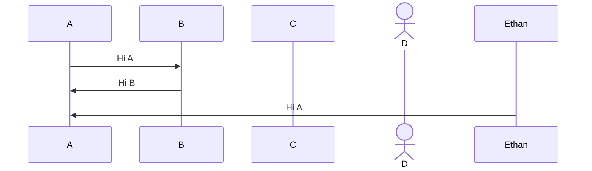
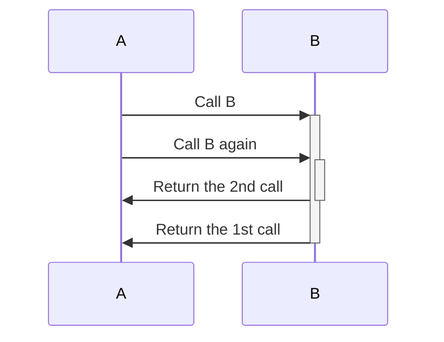
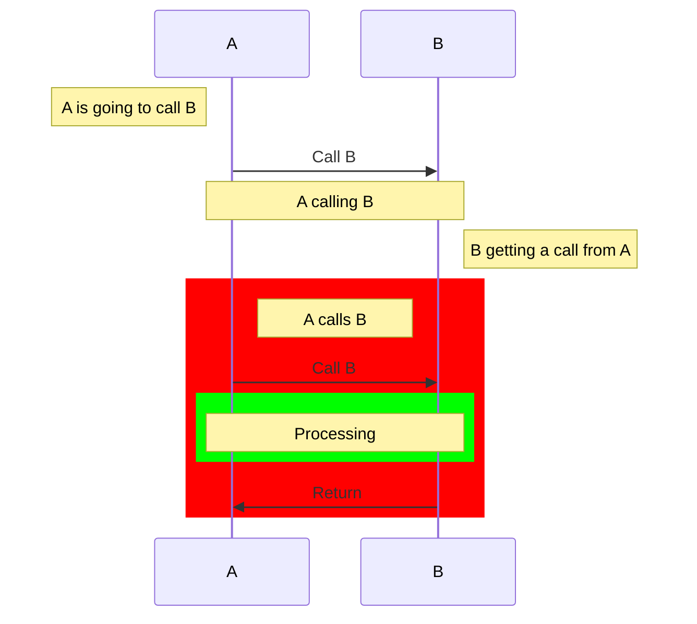

# Mermaid Sequence Diagram Quick Ref

## Basic

The basic syntax is 

```
[Actor][Arrow][Actor]:[Description text]
```



## Activation 

Activate or deactivate an actor by adding `+` or `-` after the `[Arrow]`, respectively



List of the available arrow types:

```
->
-->
->>
-->>
-x
--x
-)
--)
```

Notes and background highlighting



