# Mermaid Flowchart Quick Reference

## Basics

```
flowchart LR
  A --> B
  C[This is Node C]
  B -- Text for the link --> C
  C --> D & E --> F
```

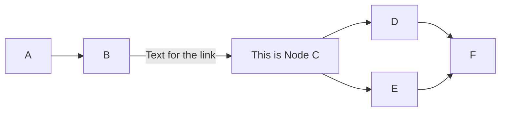

Specifying orientation `TD` (top-down) or `LR` (left-right)

```
flowchart TD
  A --> B
```

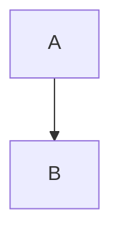

```
flowchart LR
  C --> D
```

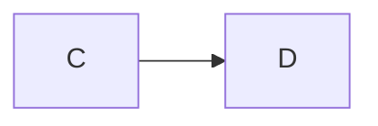

## Types of Links

```
flowchart LR
  A1 --> B1
  A1 -- with text --> B1
  A2 -.-> B2
  A2 -. with text .-> B2
  A3 ==> B3
  A3 == with text ==> B3
```

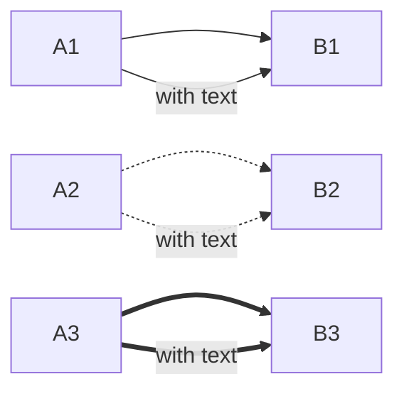

## Types of Arrows 

```
flowchart TD
  A1 --> B1
  A2 --- B2
  A3 --o B3
  A4 --x B4
  A5 <--> B5
  A6 o--o B6
  A7 x--x B7
```

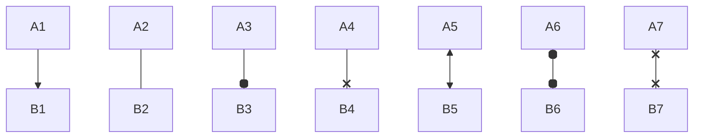

## Controlling Node Ranks

Use the length of the links to control the rank of the nodes

```
flowchart LR
  A1 --> B1
  A1 ---> B2
  A1 ------> B3
```

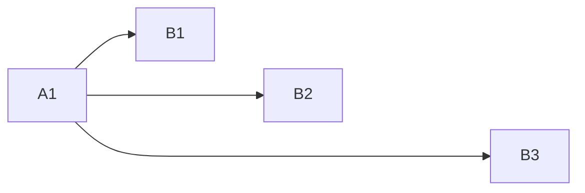

## Node Shape

```
flowchart TD
  A(round edge)
  B([stadium shape])
  C[(cylindrical shape)]
  D((circle))
  E>asymmetric shape]
  F{rhombus}
  G{{hexagon}}
  H[/parallelogram/]
  I[\parallelogram alt\]
  J[/trapezoid\]
  K(((double circle)))

  A --> B --> C
  D --> E --> F
  G --> H --> I
  J --> K
```


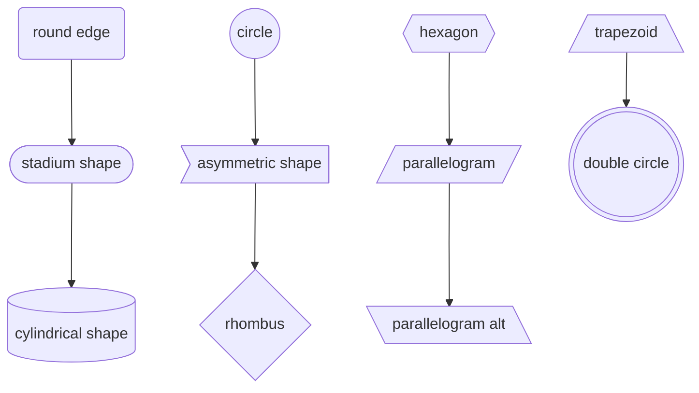

## Subgraphs

```
flowchart TB
    subgraph one
        direction LR
        a1-->a2
    end
    subgraph two
        direction TB
        b1-->b2
    end
    subgraph three[" "]
        c1-->c2
    end
```

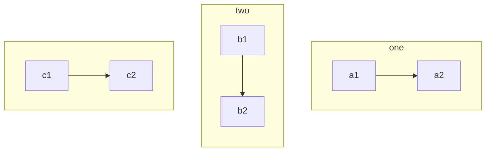

## Style

ref: https://mermaid.js.org/syntax/flowchart.html#styling-and-classes

### Styling Links

```
flowchart LR
    A --> B
    A --> B
    A -- with text --> B

    %% Styling a link by the order number of when the link was defined (starting at 0)
    linkStyle 0 stroke:#f00,stroke-width:4px
    linkStyle 1 stroke:orange,stroke-width:4px
    linkStyle 2 stroke:green,color:red

```

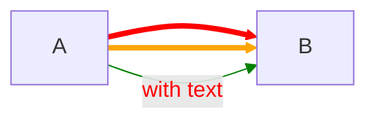

### Styling Line Curves

```
%%{ init: { 'flowchart': { 'curve': 'bumpX' } } }%%
graph LR
  A --> B
  A --> B
```

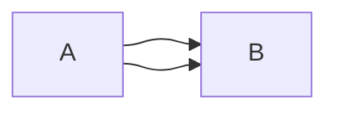

```
%%{ init: { 'flowchart': { 'curve': 'stepBefore' } } }%%
graph LR
  A --> B
  A --> B
```

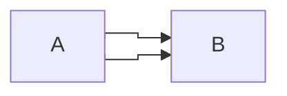

See the [curves](https://github.com/d3/d3-shape/blob/main/README.md#curves) documentation in the d3-shape project for the list of supported curve types.

### Styling Nodes

```
flowchart LR
  A --> B

  style A fill:#f9f,stroke:green,stroke-width:4px
  style B fill:#bbf,color:red
```

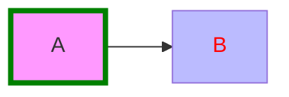

## Reference

* https://mermaid-js.github.io/mermaid/#/./flowchart?id=flowcharts-basic-syntax