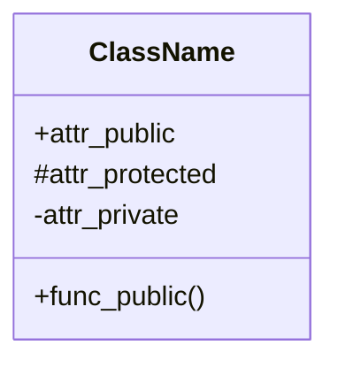
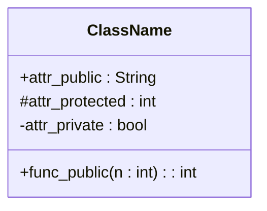
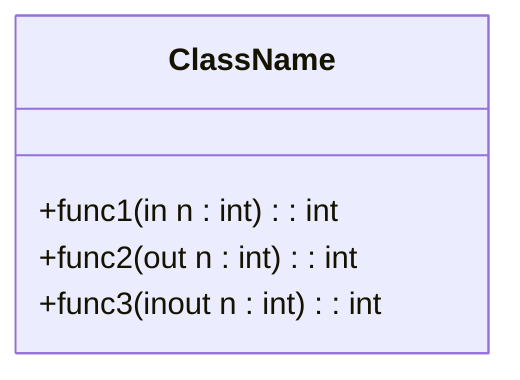
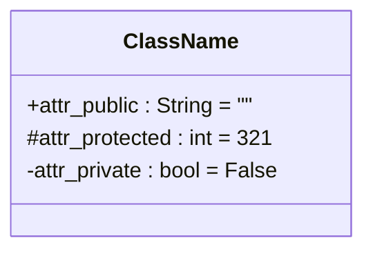
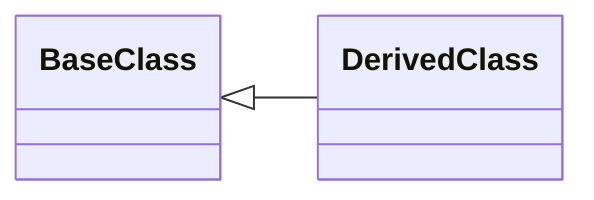
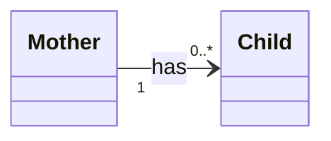
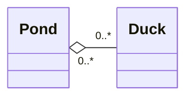
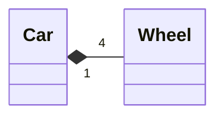
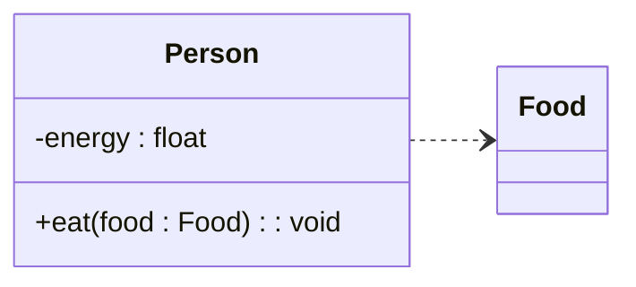
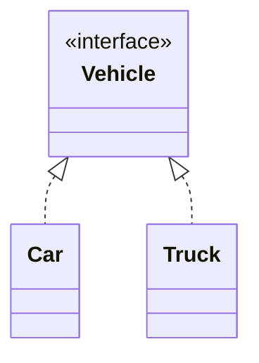

# UML Class Diagram Quick Reference

## Class Notation

Basic Example: 

Highlights:

* The "class" node consists of 3 partitions:
    * Top partition shows the name of the class
    * Middle partition shows the attributes (member variables) of the class
    * Bottom partition shows the methods (member functions) of the class
* The leading symbol before the attributes and the functions indicate their "visibility":
    * `+`: public 
    * `#`: protected
    * `-`: private

With types and signatures:

With function parameter directionality:

With default attribute value

## Relationships

### Inheritance

### Association

Highlights:

* Associations are typcially named with a verb 
* The numbers at the each end of the link is called "cardinality," indicating the number of the instances to be associated with.
    * What the example above suggests is:
        * For a given `Child`, there will be "1" `Mother` associated with the said `Child`
        * For a given `Mother`, there will be "0 or more" `Child` associated with the said `Mother`

### Aggregation

Highlights:

* Aggregation is a special type of association
* Aggregation occurs when a class is a collection or container of other classes, with the "container"-type class being next to the diamond shape of the link
* The lifecycle of the objects of the two classes in the aggregation relationship can be independent
    * In the example above, when a `Pond` object is destroyed, the `Duck` objects under `Pond` may or may not have to be destroyed.

### Composition

Highlights:

* Composition is a special type of aggregation
* Composition usually describes the "physical" containment, with the "container"-type class being next to the diamond shape of the link
* In the composition relationship, when the "container"-type class object is destroyed, its all "content"-type class objects are also destroyed.

### Dependency

Highlight:

* Dependency is a special type of association
* If class `X`'s implementation needs to access class `Y`'s member(s), but class `X` does not store `Y`'s object as part of `X`, then we say `X` is dependent on `Y`

### Realization

## Reference

* https://en.wikipedia.org/wiki/Class_diagram
* https://www.visual-paradigm.com/guide/uml-unified-modeling-language/uml-class-diagram-tutorial/